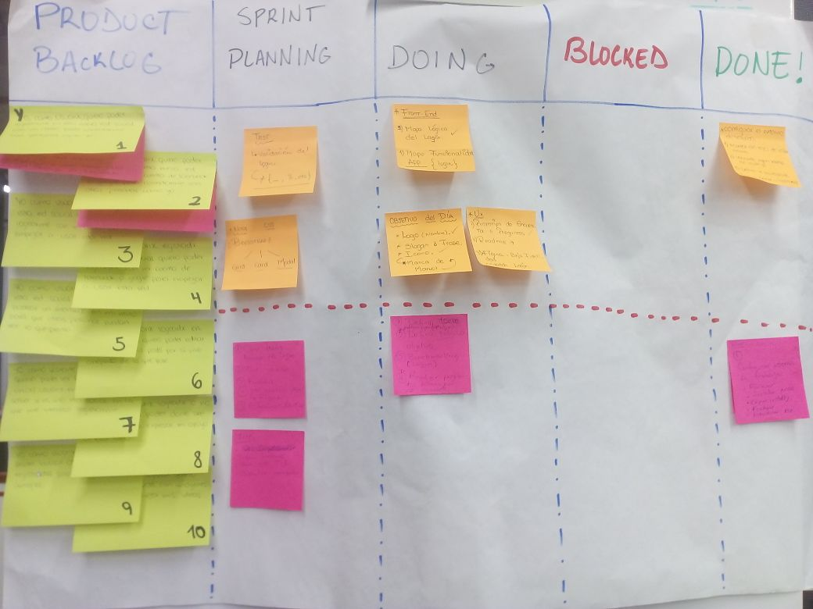
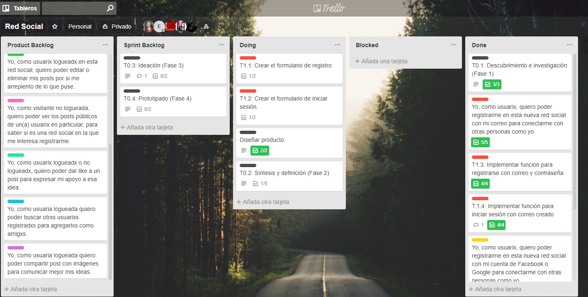
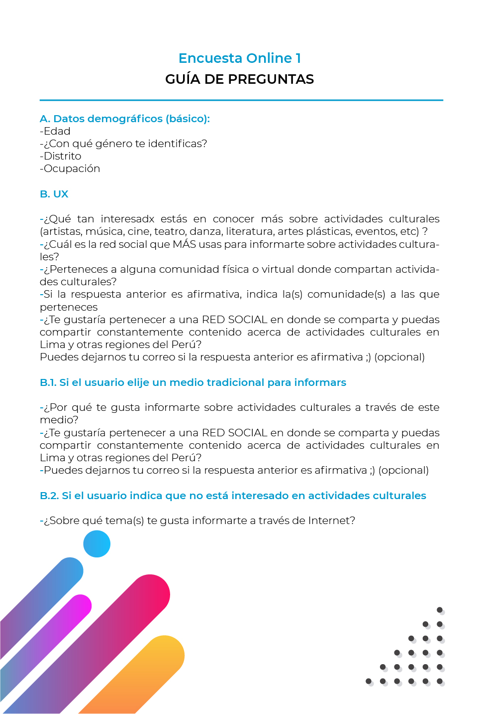
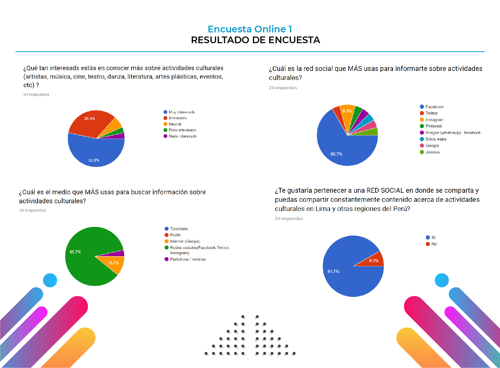

# RED SOCIAL

## ¿Qué es **nombre de red social**?
## ¿Quiénes son los principales usuarios de **nombre de red social**?

## Antes de empezar: ¿Cuáles son los elementos de una red social?

Como definición, se puede considerar a la red social como un servicio online que gira en torno al usuario y que- de forma descentralizada- le permite generar un perfil, público o privado, en el que compartir información, generar contenidos y estar al tanto de las últimas novedades relacionadas con sus intereses sociales.

Entre los diferentes elementos que conforman el concepto de red social, cabe destacar los tres siguientes:

### 1.- Elemento Sociológico
La facilidad, rapidez y desentralización de la interconexión a travès de la red generan que todos los servicios sean brindados de forma remota. Esto es un considerable avance, ya que simplifica y expande las redes sociales de nuestros usuarios. 

Cualquier usuario con acceso a Internet puede ser parte de una red social y, así, comunicarse desde cualquie punto y dispositivo con millones de personas que forman parte de la red. 

### 2.- Elemento Tecnológico

Se considera el pilar esencial gracias al cual las redes sociales han podido evolucionar y crecer de manera exponencial con la rapidez con la que lo han hecho.

Los avances en las telecomunicaciones y especialmente la difusión de las conexiones de alta velocidad —ADSL, cable, wifi, 3G, 4G…— han permitido el desarrollo de redes cada vez más completas y complejas. Todo ello, unido a la rápida e incesante evolución y abaratamiento de los dispositivos y hardware de conexión, ha hecho que el número de usuarios de este tipo de plataformas sea cada vez más elevado y, sobre todo, más recurrente en el empleo de estas redes.

### 3.- Elemento Jurídico

Vela por la legislación en Internet y sus consecuencias en la protección de datos y la privacidad de las personas, así como la protección de la producción industrial e intelectual.

## Preceso de diseño UX

## Descubrimiento

Facebook es la red social más popular del planeta. La utilizan alrededor de 400 millones de personas.
 
Las conexiones intelectuales que se labran con el intercambio cultural se intensifican con las redes sociales.
 
Tiene mucho sentido que conectar con otra persona por nuestros intereses literarios y cinematográficos sea algo emotivo, porque las novelas que leemos y los filmes que contemplamos forjan en parte nuestra memoria emocional. Y como esta memoria es imperfecta, las redes sociales de películas y libros pueden ser una buena muleta para nosotros, así que merecen una oportunidad.

### Hipótesis
En el Perú y en Latinoamérica hay una gran cantidad de artistas y personas interesadas en actividades culturales  que carecen de un espacio propio en donde- además de compartir su talento y eventos-puedan generar redes de contacto. 

### Guía de preguntas

### Resultado, análisis y conclusiones de encuesta a usuarios

A partir de la encuesta online realizada a 30 usuarios, se llegó a las siguientes conclusiones:

* Gran parte de los usuarios son estudiantes.
* Un 53.3% de los usuarios se encuentran muy interesados en actividades culturales.
* Un 33.3% se encuentra interesado.
* Más del 85% usa redes sociales para informarse sobre actividades culturales en Lima. Otro  10% a través de Google. 
* Facebook (66.7%) es la red social más usada por los usuarios que buscan este tipo de contenido. Instagram es la segunda red social, pero con un porcentaje mucho menor (8.3%).
* Más del 90% de usuarios interesados o muy interesados en cultura estarían dispuestos a pertenecer a una red social que promueva la participación de los propios ciudadanos en cuanto a la difusión de cultura y otras expresiones artísticas. 

## Definición 

## Prototipado

### - Prototipo de baja fidelidad
### - Prototipo de media fidelidad
### - Prototipo ideal
###  Test con usuario: conclusiones 

##  Benchmark: competencia (Red social para artistas)

[**_Arte Manifiesto - Perú_**](http://www.artemanifiesto.com/)

Es una red social para artistas y compradores. Promociona los trabajos de numerosos artistas. Se inició en el 2014 con el apoyo de Innovate Perú y StartUp Perú.

Es la mayor galería en línea del arte peruano cuenta con más de
dos mil artistas que han subido más de 100 mil obras.

[**_Afactys - España_**]( https://afactys.com/)
 
Es una  red social de profesionales del Arte y la Cultura. Aquí se encuentran las herramientas necesarias para poder difundir los trabajos y proyectos de cada artista.

[**_Fiction City_**]( https://www.fictioncity.net/register?l=es)

Bajo el lema “Be you. Go global” se ha lanzado Fiction City, una red social pensada para artistas no consagrados que busquen lanzar su material a la red, conectarse con personas de inquietudes similares y alcanzar el éxito gracias a la popularización de las redes sociales.

[**_Lab for Culture_**](http://www.labforculture.org/)
 
Una red social europea para aficionados del arte y la cultura.

[**_Dribble_**](https://dribbble.com)

Es sin duda alguna una de las redes sociales referentes del arte. Una web con una estética muy cuidada y muy buen material, un excelente proyecto donde los diseñadores se sienten como en casa. Si un proyecto tiene una gran cantidad de 'Me gusta' y comentarios positivos serà destacado en portada y ganará más visibilidad. 

[**_DeviantArt_**](https://www.deviantart.com/?offset=0)

Quizás, la red social más utilizada por ilustradores en el mundo. En ella puedes contar con noticias a diario y actualizaciones constantes, además de categorizar obras por temáticas y colecciones. Permite subir ilustraciones, pedir opinión profesional o vender ilustraciones. La propia web es la que se encarga de promocionar las creaciones de los ilustradores que estén en su comunidad.

[**Behance**](https://www.behance.net)

Behance es la red social pensada para artistas e ilustradores propiedad de Adobe. Sin duda, una de las plataformas online líder a nivel mundial. El sitio web muestra el talento de profesionales del sector, da visibilidad a escuelas y organizaciones creativas, distribuye el trabajo a otras galerías online y se sincroniza con ProSite, un creador de portfolios online totalmente personalizable.

Resumen de entrevistas con usuarios
 Link/screenshots del prototipo de alta fidelidad.
 Conclusiones de testing con el producto en HTML.

## Planeación

## ¿Qué es **nombre de red social**?

### a) Elementos de una red social
Como definición, se puede considerar a la red social como un servicio online que gira en torno al usuario y que, de forma descentralizada, le permite generar un perfil, público o privado, en el que compartir información, generar contenidos y estar al tanto de las últimas novedades relacionadas con sus intereses sociales.
 
Entre los diferentes elementos que conforman el concepto de red social, cabe destacar los tres siguientes:

1. Elemento Sociológico
Se puede afirmar que la facilidad y rapidez de interconexión a través de la red, así como la descentralización que implica que todos los servicios sean prestados de forma remota, suponen un auténtico avance en lo que respecta a la facilidad para iniciar o aumentar las relaciones sociales entre los usuarios.
Cualquier persona con una conexión a Internet puede formar parte de este tipo de redes sociales, comenzando así a entablar comunicación con los millones de contactos que las conforman, con absoluta independencia del lugar o dispositivo desde el que se accede, así como del momento en que se interacciona con el resto de usuarios.

2. Elemento Tecnológico
Se considera el pilar esencial gracias al cual las redes sociales han podido evolucionar y crecer de manera exponencial con la rapidez con la que lo han hecho.
Los avances en las telecomunicaciones y especialmente la difusión de las conexiones de alta velocidad —ADSL, cable, wifi, 3G, 4G…— han permitido el desarrollo de redes cada vez más completas y complejas. Todo ello, unido a la rápida e incesante evolución y abaratamiento de los dispositivos y hardware de conexión, ha hecho que el número de usuarios de este tipo de plataformas sea cada vez más elevado y, sobre todo, más recurrente en el empleo de estas redes.

3. Elemento Jurídico
Se encarga de legislación en Internet y sus consecuencias en la protección de datos y la privacidad de las personas, así como la protección de la producción industrial e intelectual.
Debido a la importancia que las redes sociales están adquiriendo en la sociedad, es importante denunciar que se están dando multitud de casos en las diferentes plataformas que no cumplen los principios más básicos de la legislación y comunitaria sobre temas tan importantes como la privacidad, el derecho a la intimidad, la propiedad industrial o intelectual o la propia normativa sobre publicidad.

### ¿Quiénes son los principales usuarios de **nombre de red social**?
### Cliente

## Proceso de diseño UX

### 1) Descubrimiento
Facebook es la reina, la red social más popular del planeta. La utilizan 400 millones de personas.
 
Las conexiones intelectuales que se labran con el intercambio cultural se intensifican con las redes sociales.
 
Tiene mucho sentido que conectar con otra persona por nuestros intereses sea algo emotivo, porque todo aquello que nos guste forja en parte nuestra memoria emocional. Y como esta memoria es imperfecta, las redes sociales pueden ser una buena muleta para nosotros, así que merecen una oportunidad.

- Hipótesis

- Guía de preguntas

### 2) Definición 

- Resultados de encuestasz

- Conclusiones de encuesta a usuarios

A partir de la encuesta online realizada a 30 usuarios, se llegó a las siguientes conclusiones:

+ Gran parte de los usuarios son estudiantes.
+ Un 53.3% de los usuarios se encuentran muy interesados en actividades culturales.
+ Un 33.3% se encuentra interesado.
+ Más del 85% usa redes sociales para informarse sobre actividades culturales en Lima. Otro  10% a través de Google. 
+ Facebook (66.7%) es la red social más usada por los usuarios que buscan este tipo de contenido. Instagram es la segunda red social, pero con un porcentaje mucho menor (8.3%).
+ Más del 90% de usuarios interesados o muy interesados en cultura estarían dispuestos a pertenecer a una red social que promueva la participación de los propios ciudadanos en cuanto a la difusión de cultura y otras expresiones artísticas. 

## ¿Qué problema resuelve **nombre de red social**?
## ¿Cuál es el objetivo principal de **nombre de red social**?
##  ¿Cómo validamos la funcionalidad de **nombre de red social**?
##  ¿Por qué los usuarios deberían de ingresar a **nombre de red social**? (Cómo te asegurarás que estos usuarios usen este producto)

## Benchmark competencia (Red social para artistas)

### Arte Manifiesto: http://www.artemanifiesto.com/ Perú
Es una red social para artistas y compradores. Promociona los trabajos de numerosos artistas. Se inició en la Primera Generación (1G) del Concurso Startup Perú(2014) del Programa Innóvate Perú que cofinanció y apoyó técnicamente esta
propuesta emprendedora.
La mayor galería en línea del arte peruano cuenta con más de
dos mil artistas que han subido más de 100 mil obras.
 
### Afactys: https://afactys.com/ España.
Es una  red social de profesionales del Arte y la Cultura. Aquí se encuentran las herramientas necesarias para poder difundir los trabajos y proyectos de cada artista.
 
### Fiction City: https://www.fictioncity.net/register?l=es
Bajo el lema “Be you. Go global” se ha lanzado Fiction City, una red social pensada para artistas no consagrados que busquen lanzar su material a la red, conectarse con personas de inquietudes similares y alcanzar el éxito gracias a la popularización de las redes sociales.

### Lab for Culture: http://www.labforculture.org/ http://ecflabs.org/
Una red social europea para aficionados del arte y la cultura.

### Pure Volume: http://www.purevolume.com/
Es una red social para el descubrimiento y la promoción de artistas emergentes. En ella cada usuario cuenta con un perfil donde colgar fotos, espectáculos, música y videos. Además en ella los artistas tienen la opción de dejar sus canciones disponibles para descarga gratuita.

### Flickr: http://www.flickr.com/
Se trata de una aplicación web que también constituye una red social, puesto que los usuarios comparten contenidos, en este caso, fotografías.

### Dribble: https://dribbble.com
Es sin duda alguna una de las redes sociales referentes del arte. Una web con una estética muy cuidada y muy buen material, un excelente proyecto donde los diseñadores se sienten como en casa. Es una red social en donde tenemos que ser capaces de conseguir la mayor cantidad de Me Gusta y comentarios positivos posible, para que nuestro proyecto sea destacado en portada y ganar más visibilidad.
 
## Implementación

### Front end

